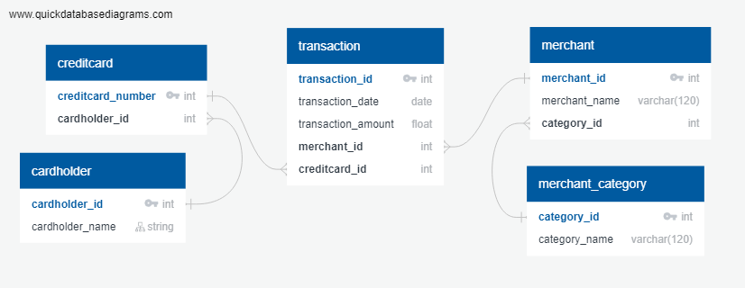

# Rice Fintech Homework - 07 - SQL
> Technologies: Python, Postgres, SQL, Plotly


*[Credit Card Fraudster by Richard Patterson](https://www.flickr.com/photos/136770128@N07/42252105582/) | [Creative Commons Licensed](https://creativecommons.org/licenses/by/2.0/)*

## Objective

In this homework assignment, I will apply SQL skills to analyze historical credit card transactions and consumption patterns in order to identify possible fraudulent transactions.

## Deliverables

1. **Data Modeling**:
Given the csv files provided, define a database model to store the credit card transaction data and create a new PostgreSQL database using your model.

* [card_holder.csv](Assignment-07-SQL/Instructions/Data/card_holder.csv)
* [credit_card.csv](Assignment-07-SQL/Instructions/Data/credit_card.csv)
* [merchant.csv](Assignment-07-SQL/Instructions/Data/merchant.csv)
* [merchant_category.csv](Assignment-07-SQL/Instructions/Data/merchant_category.csv)
* [transaction.csv](Assignment-07-SQL/Instructions/Data/transaction.csv)

2. **Data Engineering**: 
Create a database schema on PostgreSQL and populate your database from the CSV files provided.

3. **Data Analysis**: 
Analyze the data to identify possible fraudulent transactions.

## Data Modeling



``` sql
CREATE TABLE "cardholder" (
    "cardholder_id" int   NOT NULL,
    "cardholder_name" varchar(120)   NOT NULL,
    CONSTRAINT "pk_cardholder" PRIMARY KEY (
        "cardholder_id"
     )
);

CREATE TABLE "creditcard" (
    "creditcard_number" int   NOT NULL,
    "cardholder_id" int   NOT NULL,
    CONSTRAINT "pk_creditcard" PRIMARY KEY (
        "creditcard_number"
     )
);

CREATE TABLE "merchant" (
    "merchant_id" int   NOT NULL,
    "merchant_name" varchar(120)   NOT NULL,
    "category_id" int   NOT NULL,
    CONSTRAINT "pk_merchant" PRIMARY KEY (
        "merchant_id"
     )
);

CREATE TABLE "merchant_category" (
    "category_id" int   NOT NULL,
    "category_name" varchar(120)   NOT NULL,
    CONSTRAINT "pk_merchant_category" PRIMARY KEY (
        "category_id"
     )
);

CREATE TABLE "transaction" (
    "transaction_id" int   NOT NULL,
    "transaction_date" date   NOT NULL,
    "transaction_amount" float   NOT NULL,
    "merchant_id" int   NOT NULL,
    "creditcard_id" int   NOT NULL,
    CONSTRAINT "pk_transaction" PRIMARY KEY (
        "transaction_id"
     )
);

ALTER TABLE "creditcard" ADD CONSTRAINT "fk_creditcard_cardholder_id" FOREIGN KEY("cardholder_id")
REFERENCES "cardholder" ("cardholder_id");

ALTER TABLE "merchant" ADD CONSTRAINT "fk_merchant_category_id" FOREIGN KEY("category_id")
REFERENCES "merchant_category" ("category_id");

ALTER TABLE "transaction" ADD CONSTRAINT "fk_transaction_merchant_id" FOREIGN KEY("merchant_id")
REFERENCES "merchant" ("merchant_id");

ALTER TABLE "transaction" ADD CONSTRAINT "fk_transaction_creditcard_id" FOREIGN KEY("creditcard_id")
REFERENCES "creditcard" ("creditcard_number");

```